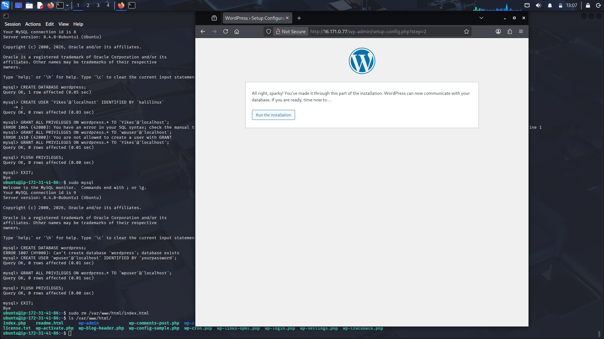
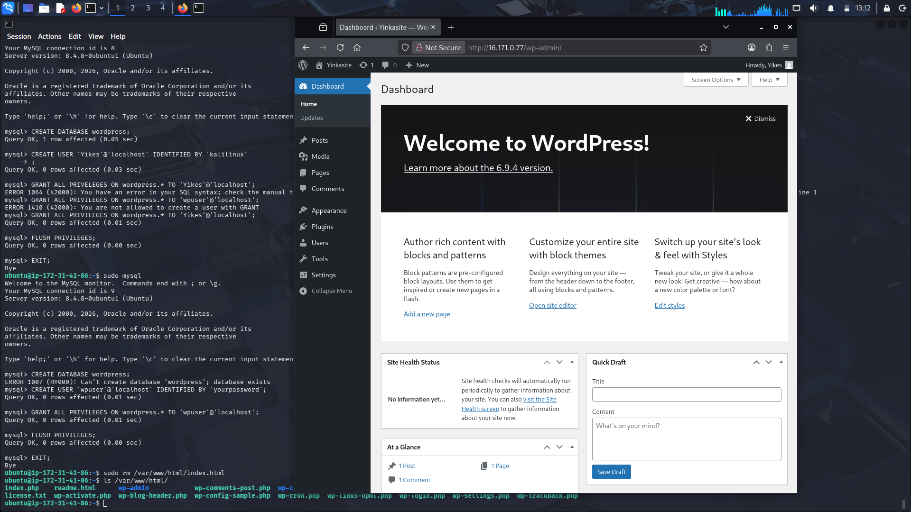
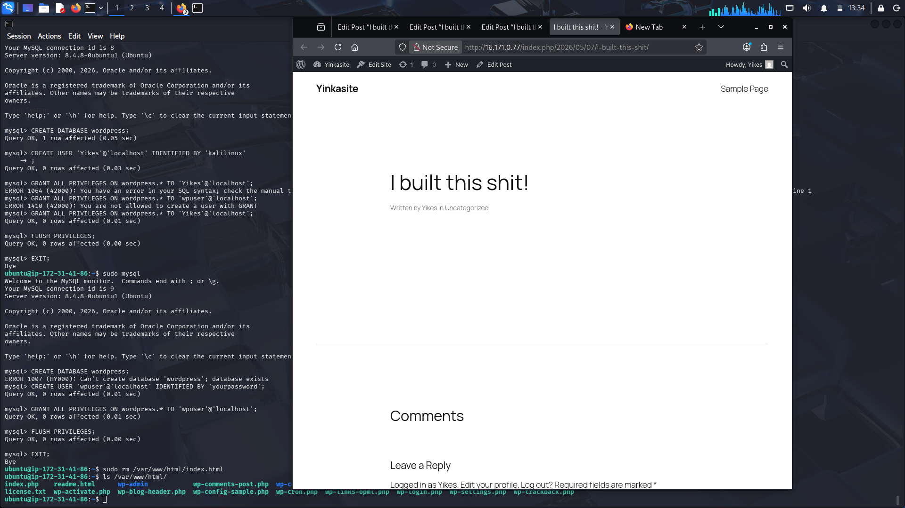

# WordPress on AWS EC2

## Project Overview
This project demonstrates deploying WordPress on an AWS EC2 instance running Ubuntu, with a LAMP stack (Linux, Apache, MySQL, PHP). It showcases cloud deployment, Linux administration, and networking fundamentals.

## Steps Taken
1. Launched EC2 instance (Ubuntu 22.04, t2.micro).
2. Configured Security Groups (SSH, HTTP, HTTPS).
3. Installed Apache, MySQL, PHP.
4. Created WordPress database and user in MySQL.
5. Deployed WordPress files to `/var/www/html/`.
6. Configured permissions and restarted Apache.
7. Completed WordPress installation via browser.

## Skills Demonstrated
- AWS EC2 provisioning
- Linux server administration
- Networking & security groups
- Database setup (MySQL)
- Application deployment

## Screenshots

